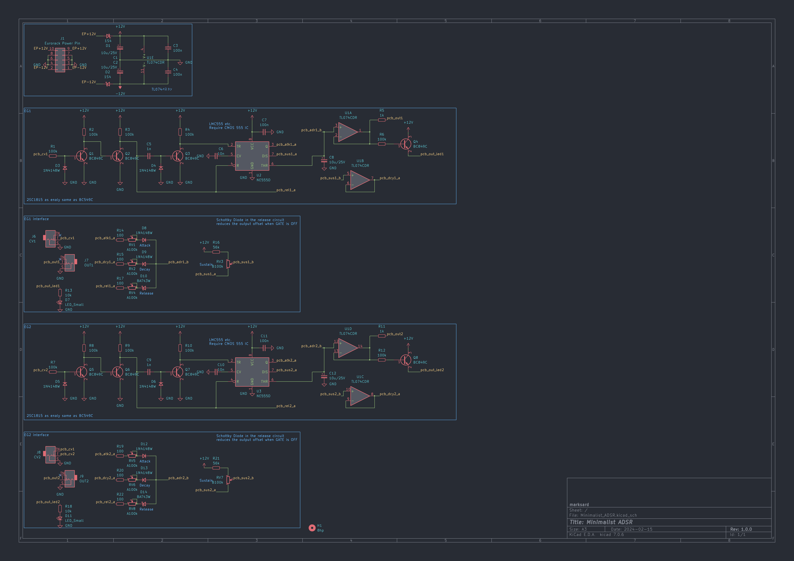

# Minimalist ADSR

Eurorack 8HP Simple 2 Envelope Generator using 555 time IC.

## Specification

### Power

|Use Voltage|Current consumption|
|:--|:--|
|+12V|20mA|
|-12V|8mA|

### Input

|Name|Description|
|:--|:--|
|CV1|Gate input 1|
|CV2|Gate input 2|

### Output

|Name|Description|
|:--|:--|
|OUT1|0-8V|
|OUT2|0-8V|

### Controller

|Name|Description|
|:--|:--|
|ATK(1)|Attack Time|
|DCY(1)|Decay Time|
|SUS(1)|Sustain Level|
|REL(1)|Release Time|
|ATK(2)|Attack Time|
|DCY(2)|Decay Time|
|SUS(2)|Sustain Level|
|REL(2)|Release Time|

## Image

## Schematic

## Envelope Curves

Blue line: Gate  
Yellow line: Envelope  

When setting the maximum time.  

